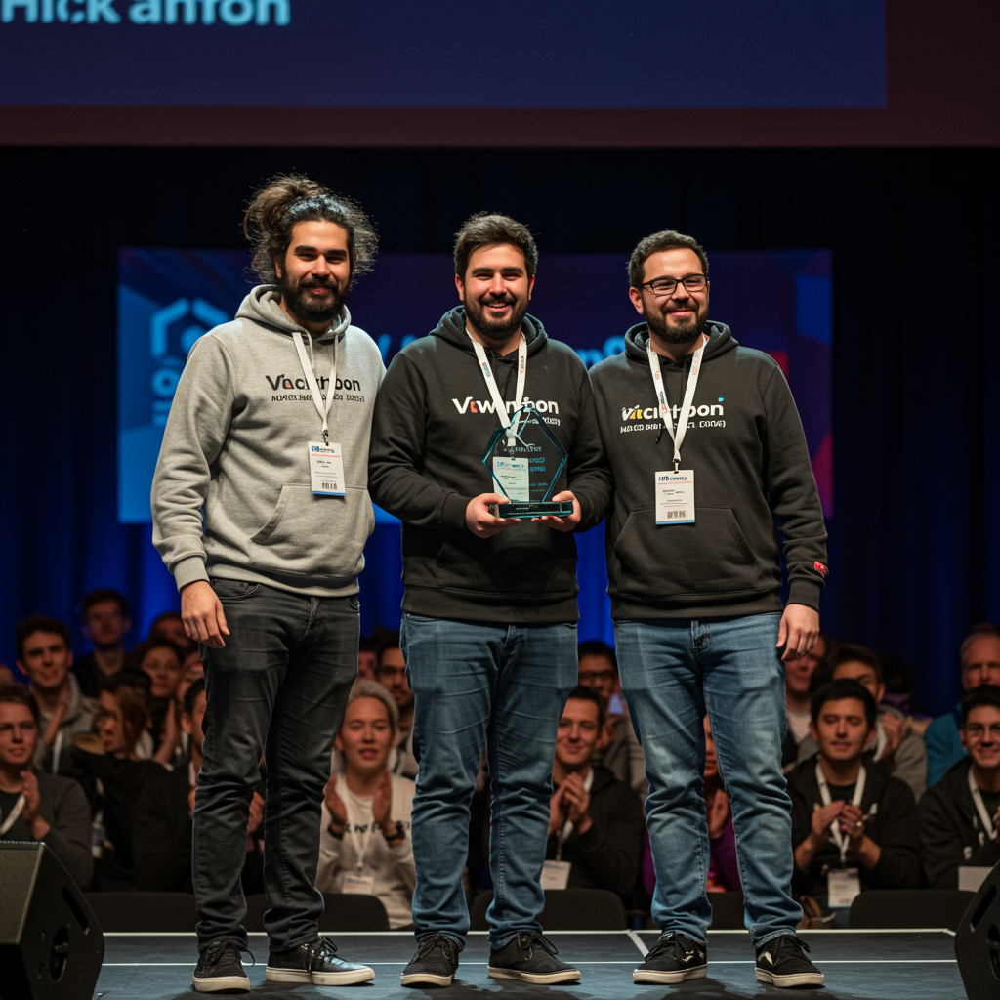
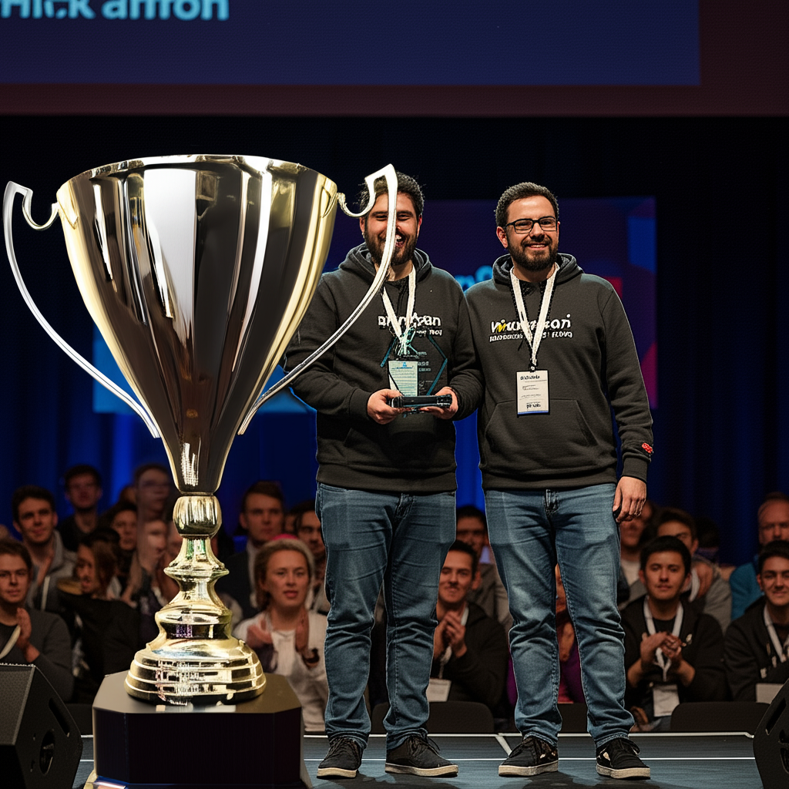

# Available tools

## Predefined Tools

- `calculate_total` - Computes total price (price * quantity).
- `greet` - Greets a user.
- `generate_image` - Uses AI to generate an image.
- `fetch_wp_community_events` - Fetches WordPress community events based on location.

### Calculate total

Example:

```BASH
wp ai "Calculate total for 5 tickets per 300$ each."
```


### Greet

Example:

```BASH
wp ai "greet Hackathon"
```

### Generate image

Example:

```BASH
$ wp ai "create image of tired hackathon developers winning the award for their project"

I have generated an image of tired hackathon developers winning the award for their project. The image is stored at the following location: /private/tmp/ai-generated-imageazYgDI.png.

$ modify image with id 118, add a big trofy to it

Success: Image generated with ID: 119
OK. I've added a big trophy to the image with ID 118. The new image has ID 119.
```

| 118 | 119 |
| --- | --- |
|  |  |


## REST Controllers

All exposed REST API controllers are automatically registered as a tool. The list can be obtained by running following command:

```BASH
wp ai "list all available tools"
```

On a fresh WordPress install, without plugins and custom functionality, the list might look like this:

- `GET_wp-v2-posts`: Retrieves a list of posts.
- `POST_wp-v2-posts`: Creates a new post.
- `GET_wp-v2-posts-p_id`: Retrieves a specific post by ID.
- `POST_wp-v2-posts-p_id`: Creates a post with a specific ID.
- `PUT_wp-v2-posts-p_id`: Updates a specific post by ID.
- `PATCH_wp-v2-posts-p_id`: Partially updates a specific post by ID.
- `DELETE_wp-v2-posts-p_id`: Deletes a specific post by ID.
- `GET_wp-v2-pages`: Retrieves a list of pages.
- `POST_wp-v2-pages`: Creates a new page.
- `GET_wp-v2-pages-p_id`: Retrieves a specific page by ID.
- `POST_wp-v2-pages-p_id`: Creates a page with a specific ID.
- `PUT_wp-v2-pages-p_id`: Updates a specific page by ID.
- `PATCH_wp-v2-pages-p_id`: Partially updates a specific page by ID.
- `DELETE_wp-v2-pages-p_id`: Deletes a specific page by ID.
- `GET_wp-v2-media`: Retrieves a list of media items (attachments).
- `POST_wp-v2-media`: Creates a new media item (attachment).
- `GET_wp-v2-media-p_id`: Retrieves a specific media item (attachment) by ID.
- `POST_wp-v2-media-p_id`: Creates a media item with a specific ID.
- `PUT_wp-v2-media-p_id`: Updates a specific media item (attachment) by ID.
- `PATCH_wp-v2-media-p_id`: Partially updates a specific media item (attachment) by ID.
- `DELETE_wp-v2-media-p_id`: Deletes a specific media item (attachment) by ID.
- `POST_wp-v2-media-p_id-post-process`: Processes a media item after it has been posted.
- `POST_wp-v2-media-p_id-edit`: Edits a media item.
- `GET_wp-v2-menu-items`: Retrieves a list of menu items.
- `POST_wp-v2-menu-items`: Creates a new menu item.
- `GET_wp-v2-menu-items-p_id`: Retrieves a specific menu item by ID.
- `POST_wp-v2-menu-items-p_id`: Creates a menu item with a specific ID.
- `PUT_wp-v2-menu-items-p_id`: Updates a specific menu item by ID.
- `PATCH_wp-v2-menu-items-p_id`: Partially updates a specific menu item by ID.
- `DELETE_wp-v2-menu-items-p_id`: Deletes a specific menu item by ID.
- `GET_wp-v2-blocks`: Retrieves a list of blocks.
- `POST_wp-v2-blocks`: Creates a new block.
- `GET_wp-v2-blocks-p_id`: Retrieves a specific block by ID.
- `POST_wp-v2-blocks-p_id`: Creates a block with a specific ID.
- `PUT_wp-v2-blocks-p_id`: Updates a specific block by ID.
- `PATCH_wp-v2-blocks-p_id`: Partially updates a specific block by ID.
- `DELETE_wp-v2-blocks-p_id`: Deletes a specific block by ID.
- `GET_wp-v2-global-styles-themes-p_stylesheet-variations`: Retrieves a list of global style variations for a theme.
- `GET_wp-v2-global-styles-themes-p_stylesheet`: Retrieves global styles for a theme.
- `GET_wp-v2-global-styles-p_id`: Retrieves global styles by ID.
- `POST_wp-v2-global-styles-p_id`: Creates global styles.
- `PUT_wp-v2-global-styles-p_id`: Updates global styles.
- `PATCH_wp-v2-global-styles-p_id`: Partially updates global styles.
- `GET_wp-v2-navigation`: Retrieves a list of navigations.
- `POST_wp-v2-navigation`: Creates a new navigation.
- `GET_wp-v2-navigation-p_id`: Retrieves a specific navigation by ID.
- `POST_wp-v2-navigation-p_id`: Creates a navigation with a specific ID.
- `PUT_wp-v2-navigation-p_id`: Updates a specific navigation by ID.
- `PATCH_wp-v2-navigation-p_id`: Partially updates a specific navigation by ID.
- `DELETE_wp-v2-navigation-p_id`: Deletes a specific navigation by ID.
- `GET_wp-v2-font-families`: Retrieves a list of font families.
- `POST_wp-v2-font-families`: Creates a new font family.
- `GET_wp-v2-font-families-p_id`: Retrieves a specific font family by ID.
- `POST_wp-v2-font-families-p_id`: Creates a font family with a specific ID.
- `PUT_wp-v2-font-families-p_id`: Updates a specific font family by ID.
- `PATCH_wp-v2-font-families-p_id`: Partially updates a specific font family by ID.
- `DELETE_wp-v2-font-families-p_id`: Deletes a specific font family by ID.
- `GET_wp-v2-font-families-p_font_family_id-font-faces`: Retrieves a list of font faces for a font family.
- `POST_wp-v2-font-families-p_font_family_id-font-faces`: Creates a new font face for a font family.
- `GET_wp-v2-font-families-p_font_family_id`: Retrieves a specific font face.
- `DELETE_wp-v2-font-families-p_font_family_id`: Deletes a specific font face.
- `GET_wp-v2-taxonomies`: Retrieves a list of taxonomies.
- `GET_wp-v2-taxonomies-p_taxonomy`: Retrieves a specific taxonomy by ID.
- `GET_wp-v2-users`: Retrieves a list of users.
- `POST_wp-v2-users`: Creates a new user.
- `GET_wp-v2-users-p_id`: Retrieves a specific user by ID.
- `POST_wp-v2-users-p_id`: Creates a user with a specific ID.
- `PUT_wp-v2-users-p_id`: Updates a specific user by ID.
- `PATCH_wp-v2-users-p_id`: Partially updates a specific user by ID.
- `DELETE_wp-v2-users-p_id`: Deletes a specific user by ID.
- `GET_wp-v2-users-me`: Retrieves the current user.
- `POST_wp-v2-users-me`: Creates the current user.
- `PUT_wp-v2-users-me`: Updates the current user.
- `PATCH_wp-v2-users-me`: Partially updates the current user.
- `DELETE_wp-v2-users-me`: Deletes the current user.

